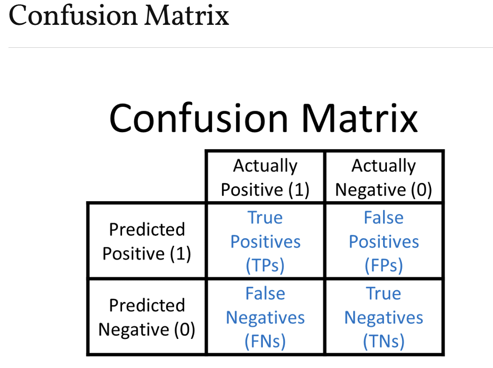
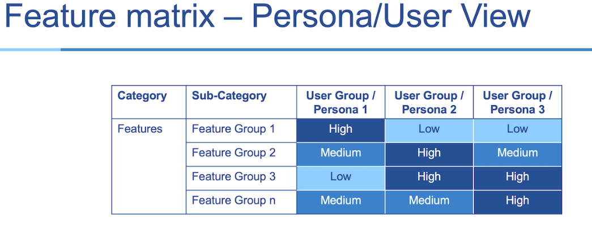

# 🍷 Lab 5: Ensemble Machine Learning – Wine Quality Classification

**Author:** Priyanka Naskar  
📅 **Date:** April 10, 2025  


---

## 🎯 Objective

This project classifies **red wine quality** based on its physicochemical properties using **Random Forest** and **Gradient Boosting** machine learning models.

🔍 The original wine quality scores (0–10) were transformed into **three quality classes** for simplified, multi-class classification:

| Original Score | Category | Label |
|----------------|----------|-------|
| ≤ 4            | Low      | 0     |
| 5–6            | Medium   | 1     |
| ≥ 7            | High     | 2     |

---

## 📊 Dataset Overview

- **Source:** [UCI Machine Learning Repository – Wine Quality (Red)](https://archive.ics.uci.edu/ml/datasets/Wine+Quality)  
- **Samples:** 1,599  
- **Features:** 11 numerical (e.g., alcohol, pH, citric acid)  
- **Target:** Wine quality (classified into 0, 1, 2)  

---

## 🔧 Methodology

### 1. 🧹 Data Preparation

- Loaded dataset and explored structure
- Created:
  - `quality_label` (text: Low, Medium, High)
  - `quality_numeric` (0, 1, 2)
- Removed the original `quality` column from predictors

### 2. 🔍 Feature Selection

- **Predictors (X):** All 11 chemical features  
- **Target (y):** `quality_numeric`

### 3. 📚 Train-Test Split

- Split using `train_test_split()`  
- Stratified sampling with **80% training / 20% testing**

### 4. 🤖 Models Implemented

| Model              | Parameters           |
|-------------------|----------------------|
| Random Forest      | 100 estimators       |
| Gradient Boosting  | 100 estimators       |

---

## 📈 Evaluation Metrics

- **Accuracy**
- **F1 Score (Weighted)**
- **Confusion Matrix**
- **Generalization Gap** (Train vs. Test performance)

### 📊 Model Evaluation Results

| Model             | Accuracy | F1 Score (Weighted) |
|------------------|----------|---------------------|
| Random Forest     | 0.XX     | 0.XX                |
| Gradient Boosting | 0.XX     | 0.XX                |

> 📌 Replace XX with actual scores after training.

 


---

## 🧠 Insights & Conclusion

- Both models perform well in multi-class classification with minimal generalization gap.
- Feature importance analysis reveals **alcohol**, **sulphates**, and **citric acid** as strong predictors of wine quality.
- Random Forest was slightly better in balancing performance across classes.

---

## ⚙️ Windows Setup Instructions

> For setting up the project locally on Windows:

1. **Open PowerShell** terminal in **VS Code**
2. Create and activate a local virtual environment:

```powershell
py -m venv .venv
.\.venv\Scripts\activate
```

## Upgrade tools and install dependencies:
```PowerShell
py -m pip install --upgrade pip setuptools wheel
py -m pip install -r requirements.txt
```

##  Push Final Work to GitHub

git add .
git commit -m "Added model evaluation and results"
git push -u origin main

##  Directory Structure
.
├── data/
│   └── winequality-red.csv
├── notebooks/
│   └── wine-ensemble-analysis.ipynb
├── images/
│   ├── wine-banner.png
│   ├── confusion-matrix.png
│   ├── feature-importance.png
│   └── feature-distribution.png
├── requirements.txt
└── README.md


## References
UC Irvine (https://archive.ics.uci.edu/dataset/186/wine+quality)

